<meta name="viewport" content="width=device-width, initial-scale=1">
<link rel="stylesheet" href="github-markdown.css">
<article class="markdown-body">

The solution to the heap lab at INSA Rennes. To run the seam carving user interface:
```bash
mvn javafx:run
```

To reduce the image horizontally click on the down arrow key. To reduce the image vertically use the left arrow key.

# TP files de priorité

Dans ce TP nous allons implémenter des [files de priorité](https://algs4.cs.princeton.edu/24pq/) que nous utiliserons dans l'implémentation de l'algorithme
de plus court chemin de [Dijkstra](https://fr.wikipedia.org/wiki/Algorithme_de_Dijkstra).
Nous utiliserons cet algorithme pour implémenter un solveur du jeu [Le Compte est Bon](http://a.vouillon.online.fr/comptbon.htm) et ensuite une application
de [Seam Carving](https://www.aryan.app/seam-carving/).

## Préparation

Le projet est réalisé avec [Maven](https://en.wikipedia.org/wiki/Apache_Maven), qui va nous permettre de gérer facilement toutes les dépendances du projet,
le lancement des tests et l'exécution.

## Files de priorité

Vous allez réaliser dans cette partie une file de priorité `HeapPQ` en utilisant les tas, qui nous servira plus tard pour implémenter
l'algorithme de Dijkstra. L'interface des files de priorité suivante se trouve dans
le package `fr.insa_rennes.sdd.priority_queue`.

```java
public interface PriorityQueue<T> {
  boolean isEmpty();
  int size();
  void add(T e);
  T peek();
  T poll();
}
```

* `boolean isEmpty()` rend `true` si la file de priorité est vide et `false` sinon.
* `int size()` retourne la taille de la file de priorité.
* `void add(T e)` ajoute l'élément `e` dans la file de priorité.
* `T peek()` rend l'élément en tête de la file de priorité.
* `T poll()` rend l'élément en tête de la file de priorité et le retire de la file.

On vous fourni une implémentation peu efficace de cette interface dans la classe `OrderedArrayPQ<T>` du package `fr.insa_rennes.sdd.priority_queue`.
Cette classe va vous permettre d'avoir un exemple pour deux points particuliers de l'implémentation.

````java
public class OrderedArrayPQ<T> implements PriorityQueue<T> {
    private static final int DEFAULT_INITIAL_CAPACITY = 8;
    private Comparator<? super T> comparator;
    private int size;
    private T[] array;

    public OrderedArrayPQ() {
        this(DEFAULT_INITIAL_CAPACITY, null);
    }
    @SuppressWarnings("unchecked")
    public OrderedArrayPQ(int initialCapacity, Comparator<? super T> comparator) {
        if (initialCapacity < 1) {
            throw new IllegalArgumentException();
		}
		array = (T[])new Object[initialCapacity];
		this.comparator =
            comparator == null ? (t1, t2) -> ((Comparable<? super T>)t1).compareTo(t2) : comparator;
	}
    @Override
	public void add(T e) {
        if (e == null) {
            throw new NullPointerException();
        }
        if (size >= array.length) {
            grow();
        }
        int index = Arrays.binarySearch(array, 0, size, e, comparator);
        if (index >= 0) {
            insert(e, index);
        } else {
            insert(e, -(index + 1));
        }
        size++;
    }
}
````

À la ligne 3 on peut voir le comparateur qui va permettre d'ordonner les éléments de la file. L'utilisateur peut le fournir
au constructeur à la ligne 11, mais s'il ne le fournit pas, on utilise le comparateur du type `T` à la ligne 17^[C'est réalisé ainsi dans la classe `PriorityQueue` de Java.].
Si l'utilisateur ne fournit pas de comparateur et que le type `T` ne permet pas d'être comparé, il en résultera une erreur à l'exécution.
Vous pourrez réutiliser cette façon de procéder dans votre implémentation.

À la ligne 25, on peut voir l'appel à la méthode `grow` qui permet de redimensionner le tableau `array` si celui-ci devient trop petit. Vous pourrez utiliser `grow` de la même manière
dans votre implémentation.

Vous devez compléter la classe `HeapPQ` pour implémenter maintenant une version efficace de la file de priorité en utilisant [un tas](https://fr.wikipedia.org/wiki/Tas_(informatique)).

Vous pouvez tester votre classe avec les tests `Junit` dans l'ordre suivant.

* `HeapPQTest`.
* `HeapPQQuickCheckTest`.
* `AllPQQuickCheckTest`.

Vous pouvez lancer les tests depuis `Eclipse` ou bien en ligne de commande avec `Maven`. Pour lancer tous les tests du projet on utilise la commande suivante.

```bash
mvn test
```

Pour lancer un test spécifique, par exemple le test `HeapPQTest`, on utilise la commande suivante.

```bash
mvn -Dtest=HeapPQTest test
```

Votre implémentation devrait normalement avoir une complexité en $O(\log n)$ avec $n$ la taille de la file pour les méthodes `add` et `poll` contre une complexité en $O(n)$ pour la
classe `OrderedArrayPQ<T>`, autant dire que la différence en temps devrait être très visible. Vous pouvez exécuter la classe `PoorBenchmarkPQ` qui va
comparer les deux implémentations. Normalement il faudrait
utiliser une librairie comme [JMH](https://openjdk.java.net/projects/code-tools/jmh/), par exemple, pour faire du benchmarking plus précis, mais vu la différence
énorme de temps d'exécution, notre simple classe suffira.


## Dijkstra

L'algorithme de [Dijkstra](https://fr.wikipedia.org/wiki/Algorithme_de_Dijkstra) va nous permettre de rechercher le plus court chemin d'un sommet d'un graphe vers tous les autres. Pour l'utiliser, nous avons tout
d'abord besoin de représenter un graphe. L'interface `Graph<T>` du package `fr.insa_rennes.sdd.graph` va nous permettre de décrire un graphe dont les sommets sont de type `T`.

```java
public interface Graph<T> {
    int numberOfVertices();
    int numberOfEdges();
    void addVertex(T v);
    void addEdge(T u, T v, double weight);
    Iterable<VertexAndWeight<T>> neighbors(T u);
}
```

* `int numberOfVertices()` rend le nombre de sommets.
* `int numberOfEdges()` rend le nombre d'arcs.
* `void addVertex(T v)` permet d'ajouter le sommet `v`.
* `void addEdge(T u, T v, double weight)` ajoute l'arc entre les sommets `u` et `v` avec le poids `weight`.
* `Iterable<VertexAndWeight<T>> neighbors(T u)` rend un itérable sur les couples `(sommet, poids)` représentant les voisins du sommet `u` avec le poids des arcs entre `u` et le
voisin donné.

La classe `VertexAndWeight` permet de représenter un couple `(sommet, poids)`.

```java
public class VertexAndWeight<T> {
    public final T vertex;
    public final double weight;

    public VertexAndWeight(T vertex, double weight) {
        this.vertex = vertex;
        this.weight = weight;
    }
}
```

Un exemple d'implémentation d'un graphe simple où les sommets sont des entiers vous est donné dans la classe `IndexedGraph`. Par exemple,
on pourrait représenter le graphe suivant,


en faisant,

```java
public static void main(String[] args) {
    Graph<Integer> g = new IndexedGraph(5);
    g.addEdge(0, 1, 3);
    g.addEdge(0, 3, 10);
    g.addEdge(1, 2, 4);
    g.addEdge(1, 3, 1);
    g.addEdge(3, 4, 3);
    g.addEdge(4, 3, 2);
}
```

Vous allez maintenant implémenter l'algorithme de [Dijkstra](https://fr.wikipedia.org/wiki/Algorithme_de_Dijkstra). La classe `Dijkstra<T>` du package `fr.insa_rennes.sdd.dijkstra`
est une ébauche que vous allez devoir compléter.

````java
public class Dijkstra<T> {
    private final PriorityQueue<DijkstraNode<T>> pq;
    private final Map<T, Double> cost = new HashMap<>();
    private final Map<T, T> prev = new HashMap<>();

    public Dijkstra(Graph<T> graph, T source) {
        this(graph, source, FactoryPQ.newInstance("HeapPQ"));
    }

    public Dijkstra(Graph<T> graph, T source, PriorityQueue<DijkstraNode<T>> pq) {
        this.pq = pq;
        solve(graph, source);
    }

    private void solve(Graph<T> graph, T source) {
      // TO DO
    }

    public Deque<T> getPathTo(T v) {
      // TO DO
    }

    public double getCost(T v) {
        return cost.getOrDefault(v, Double.POSITIVE_INFINITY);
    }

    public boolean hasPathTo(T v) {
        return getCost(v) != Double.POSITIVE_INFINITY;
    }
}
````

* `void solve(Graph<T> graph, T source)` lance toute la recherche à partir du sommet `source` du graphe `graph`. Cette méthode utilisera
l'attribut `pq` comme file de priorité. Elle remplira les attributs `cost` et `prev` durant cette recherche.

    * `cost` est une table d'association entre un sommet et un réel, permettant de connaître le coût minimum pour aller de la source vers un certain sommet.
    * `prev` permet de donner le sommet prédécesseur d'un sommet donné vers la source. Cette table d'association permettra de coder la méthode `getPathTo`.

* `Deque<T> getPathTo(T v)` rend une collection qui donne le chemin pour aller de la source vers le sommet `v`. Grâce à la table `prev`, on peut connaître le prédécesseur de `v`, puis
le prédécesseur du prédécesseur et ainsi de suite, jusqu'à retomber sur le sommet source.

La classe `DijkstraNode<T>` permet de représenter un sommet avec sa distance depuis la source et son prédécesseur pendant la recherche dans `solve`. La file de priorité `pq` contient
des `DijkstraNode`.

````java
public class DijkstraNode<T> implements Comparable<DijkstraNode<T>> {
	final Double cost;
	final T vertex;
	final T prev;

	public DijkstraNode(Double cost, T vertex) {
		this(cost, vertex, null);
	}

	public DijkstraNode(Double cost, T vertex, T prev) {
		this.cost = cost;
		this.vertex = vertex;
		this.prev = prev;
	}

	@Override
	public int compareTo(DijkstraNode<T> node) {
		return Double.compare(cost, node.cost);
	}
}
````

`int compareTo(DijkstraNode<T> node)` permet de comparer deux noeuds suivant leur distance à la source. Ainsi, l'élément à la racine du tas de la file de priorité `pq` sera celui
ayant la distance la plus petite à la source.

L'implémentation de l'algorithme de Dijkstra avec une file de priorité peut se décrire assez succinctement.

1. Initialement, on met dans la file de priorité `pq` la source avec une distance de 0.
2. Tant que `pq` n'est pas vide,

    3. On retire le premier `DijkstraNode n` de la file.
    4. On regarde si le sommet `n.vertex` que l'on vient de sortir de la file à déjà été traité (en regardant s'il est présent dans `cost`). Si oui, on va en `2`, sinon on continue.
    5. On met à jour les tables `cost` et `prev` grâce à `n`.
    6. Pour chaque voisin `v` de `n.vertex`,

        7. On calcul la distance à `v` en fonction de `n` et on ajoute un nouveau `DijkstraNode` à le file de priorité `pq`.

Une petite animation de l'algorithme de Dijkstra se trouve [ici](https://www.cs.usfca.edu/~galles/visualization/Dijkstra.html). On peut se demander l'utilité de l'étape 4. En fait,
l'implémentation qu'on vient de décrire s'appelle `LazyDijkstra`, des explications sont fournies [ici](https://www.cs.princeton.edu/courses/archive/spr10/cos226/lectures/15-44ShortestPaths-2x2.pdf)
au transparent 21, ou vous pouvez demander à votre encadrant &#x1f642;.


Vous pouvez tester votre implémentation de Dijkstra en lançant le test `Junit` `DijkstraTest`, sous eclipse ou en utilisant la commande suivante.

```bash
mvn -Dtest=DijkstraTest test
```

## Le compte est bon

Toute la promotion s'est prise de passion pour le jeu du [compte est bon](https://www.youtube.com/watch?v=t_4dAYk5ySY&t=). On voudrait devenir champion de la promotion et pour se faire,
on va se construire un solveur pour pouvoir s'entraîner.

On va utiliser l'algorithme de Dijkstra pour réaliser ce solveur. Le code du solveur est donné dans la classe `LeCompteEstBonSolver` du package `fr.insa_rennes.sdd.dijkstra`. Il vous
reste à créer le graphe qui va représenter l'espace de recherche du compte est bon.

La classe le `LeCompteEstBonGraph` se trouve dans le package `fr.insa_rennes.sdd.graph`.

````java
public class LeCompteEstBonGraph implements Graph<LeCompteEstBonGraph.State> {
	private int[] plaques;
	private double[] operatorsCost = {1, 1, 2, 6};
	private static final int ADD = 6;
	private static final int MINUS = 7;
	private static final int TIMES = 8;
	private static final int DIV = 9;
	private Map<State, HashSet<VertexAndWeight<State>>> adjacency = new HashMap<>();
	private Map<Integer, ArrayList<State>> compteToState = new HashMap<>();
	private int numberOfEdges;

	public LeCompteEstBonGraph(int...plaques) {
		this.plaques = plaques;
	}

	public void setOperatorCost(int op, double cost) {
		operatorsCost[op - ADD] = cost;
	}

	public double getOperatorCost(int op) {
		return operatorsCost[op - ADD];
	}

	public Map<Integer, ArrayList<State>> compteToState() {
		return compteToState;
	}

	@Override
	public int numberOfVertices() {
		return adjacency.size();
	}

	@Override
	public int numberOfEdges() {
		return numberOfEdges;
	}

	@Override
	public void addVertex(State v) {
		throw new UnsupportedOperationException();
	}

	@Override
	public void addEdge(State u, State v, double weight) {
		throw new UnsupportedOperationException();
	}

	@Override
	public Iterable<VertexAndWeight<State>> neighbors(State s) {
		if (adjacency.containsKey(s)) {
			return adjacency.get(s);
		}
		HashSet<VertexAndWeight<State>> neighbors = s.neighbors();
		adjacency.put(s, neighbors);
		for (VertexAndWeight<State> vw : neighbors) {
			int compte = vw.vertex.getCompte();
			if (compte == State.UNFINISHED) continue;
			if (!compteToState.containsKey(compte)) {
				compteToState.put(compte, new ArrayList<>());
			}
			compteToState.get(compte).add(vw.vertex);
		}
		numberOfEdges += neighbors.size();
		return neighbors;
	}

	public State initialState() {
		return new State(0, State.UNFINISHED);
	}

	public class State {
		private static final int UNFINISHED = -1;
		private static final int IMPOSSIBLE = -2;
		private long stack;
		private int compte;

		private State(long stack, int compte) {
			this.stack = stack;
			this.compte = compte;
		}
		public int getCompte() {
			return compte;
		}
		private HashSet<VertexAndWeight<State>> neighbors() {
			HashSet<VertexAndWeight<State>> neighbors = new HashSet<>();
            // TO DO
            return neighbors;
		}
		private SmallSet plaques(long stack) {
			SmallSet res = new SmallSet();
			int n = size(stack);
			for (int i = 1; i <= n; i++) {
				int v = get(stack, i);
				if (v < ADD) {
					res.insert(v);
				}
			}
			return res;
		}
		private int compte(long stack) {
            // TO DO
			return UNFINISHED;
		}
		private int get(long stack, int index) {
			return (int) ((stack & (0xFL << index * 4)) >>> index * 4);
		}
		private long set(long stack, int index, long v) {
			stack = stack & ~(0xFL << index * 4);
			stack = stack | (v << index * 4);
			return stack;
		}
		private int size(long stack) {
			return get(stack, 0);
		}
		private long push(long stack, int v) {
			int n = get(stack, 0);
			stack = set(stack, n + 1, v);
			stack = set(stack, 0, n + 1);
			return stack;
		}
	}
}
````

La méthode `double[][] energyMap()` à la ligne 14 rend une matrice de `double` représentant l'énergie de chaque pixel de l'image `picture` en utilisant la fonction `energyFunction` dont la valeur par défaut est définie
à la ligne 6.

Maintenant que nous avons cette matrice avec l'énergie de chaque pixel, comment réduire l'image en prenant en compte cette information ?

Pour réduire verticalement, nous allons considérer la matrice d'énergie comme un graphe. Ce graphe est représenté ci-dessous.

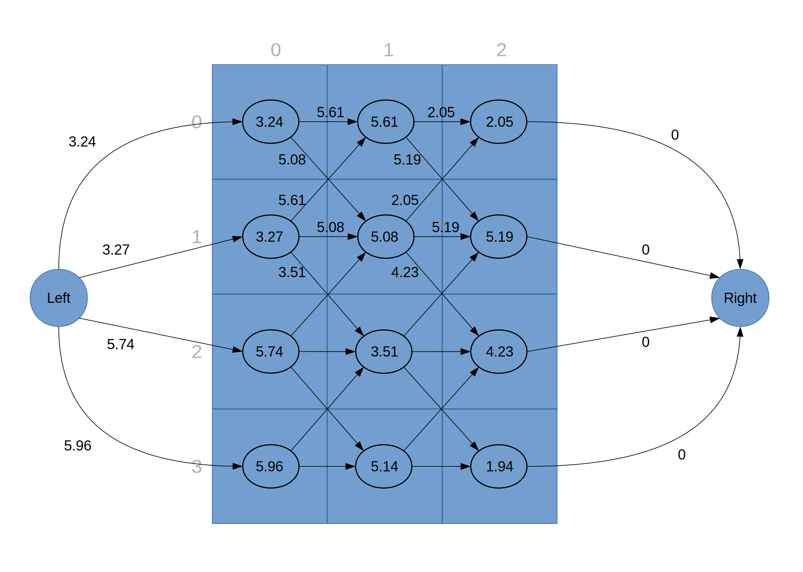

Vous pouvez remarquer que l'on a ajouté deux sommets : `Left` et `Right`. Les poids sur les arcs sont les valeurs d'énergie du pixel d'arrivé.
Par exemple, le poids de l'arc allant de `(0,0)` en `(1,1)` est l'énergie du pixel `(1,1)`^[Nous n'avons pas représenté tous les poids sur l'image pour ne pas allourdir la figure.].

Maintenant, nous allons utiliser `Dijkstra` sur ce graphe pour trouver le chemin de moindre énergie entre les sommets `Left` et `Right`. Nous obtenons alors le chemin suivant.

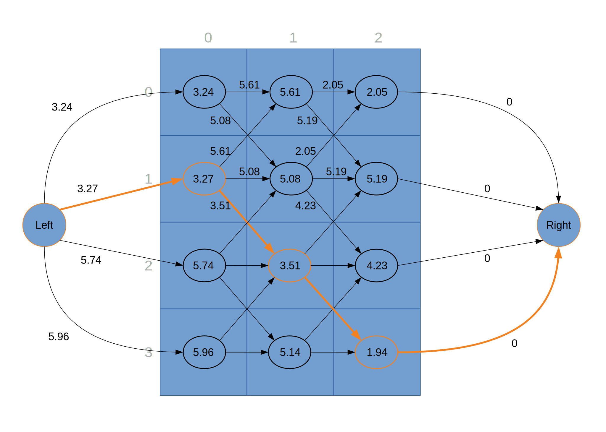

Pour réduire l'image, il nous reste simplement à supprimer les pixels du chemin. Pour notre exemple, nous obtenons la figure suivante.

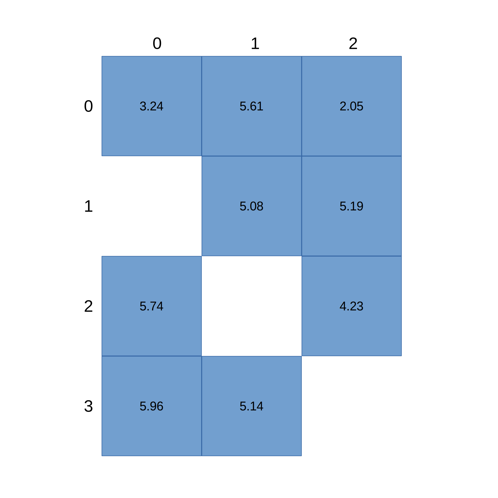

Il reste enfin à compacter les colonnes pour supprimer les trous. Nous obtenons la figure suivante.

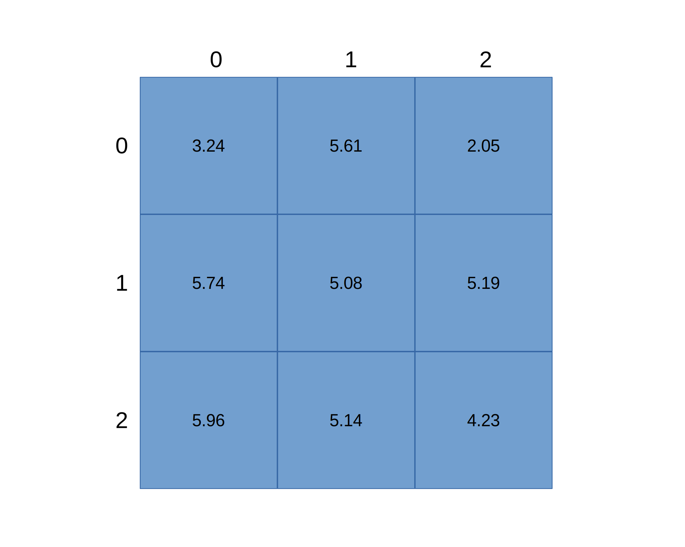

Notons que pour continuer d'appliquer le recadrage intelligent à la nouvelle image, il faudra recalculer une matrice d'énergie à partir de cette nouvelle image.

Pour réduire horizontalement une image, on procède de façon similaire, mais à partir du graphe suivant.

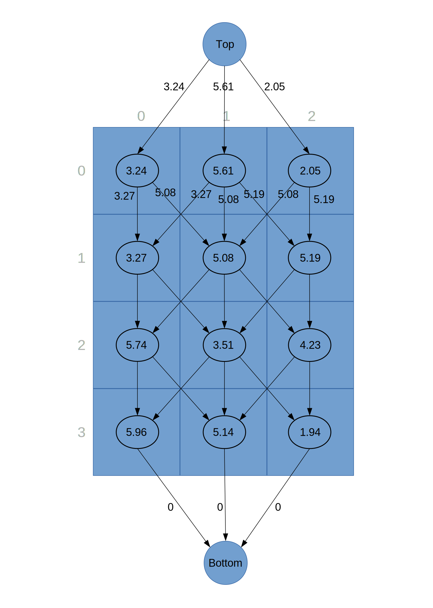

### Recadrage intelligent en utilisant Dijkstra

Pour construire les deux graphes que nous venons de présenter, vous devrez utiliser les deux classes `LeftToRightGridGraph` et `TopToBottomGridGraph` du package `fr.insa_rennes.sdd.graph`.
Pour créer le graphe allant de la gauche vers la droite à partir de la matrice d'énergie `energyMap`, il suffit d'exécuter la ligne suivante.

```java
new LeftToRightGridGraph(energyMap);
```

Le sommet `Left` est représenté par la classe `Coordinate.Left` et le sommet `Right` par la classe `Coordinate.Right`.
Pour créer un graphe allant du haut vers le bas, il suffit d'exécuter la ligne suivante.

```java
new TopToBottomGridGraph(energyMap);
```

Le sommet `Top` est représenté par la classe `Coordinate.Top` et le sommet `Bottom` par la classe `Coordinate.Bottom`.

Vous allez maintenant implémenter le recadrage intelligent en utilisant les graphes `LeftToRightGridGraph` et `TopToBottomGridGraph` et l'algorithme de `Dijkstra`. La classe que vous devez compléter
est la classe `SeamCarverDijkstra` du package `fr.insa_rennes.sdd.seam_carving`.

````java
public class SeamCarverDijkstra extends SeamCarver {
    public SeamCarverDijkstra(Picture picture) {
        super(picture);
    }
    public SeamCarverDijkstra(Picture picture, BiFunction<Double, Double, Double> energyFunction) {
        super(picture, energyFunction);
    }
    @Override
    public void reduceToSize(int width, int height) {
        throw new UnsupportedOperationException();
    }
    @Override
    public Deque<Coordinate> horizontalSeam() {
        throw new UnsupportedOperationException();
    }
    @Override
    public Deque<Coordinate> verticalSeam() {
        throw new UnsupportedOperationException();
    }
}
````

Vous devez compléter les méthodes suivantes.

 * `Deque<Coordinate> horizontalSeam()` qui rend les coordonnées du plus court chemin entre les sommets `Left` et `Right`. Les coordonnées `Left` et `Right` n'y sont pas incluses.
 * `Deque<Coordinate> verticalSeam()` qui rend les coordonnées du plus court chemin entre les sommets `Top` et `Bottom`. Les coordonnées `Top` et `Bottom` n'y sont pas incluses.
 * `void reduceToSize(int width, int height)` qui reduit l'image `picture` aux dimensions `width x height`. Vous pouvez tout d'abord réduire l'image jusqu'à ce que sa largeur devienne `width` puis
 ensuite la réduire jusqu'à ce que sa hauteur devienne `height`. Les méthodes `cropHorizontal` et `cropVertical` de la classe `SeamCarver` vous seront utiles.

    * `void cropHorizontal(Deque<Coordinate> seam)` met à jour l'image `picture` en retirant toutes les coordonnées de `seam`. La hauteur de l'image va être réduite d'un pixel.
    * `void cropVertical(Deque<Coordinate> seam)` met à jour l'image `picture` en retirant toutes les coordonnées de `seam`. La largeur de l'image va être réduite d'un pixel.

 Vous pouvez tester en exécutant la commande suivante.

```bash
mvn javafx:run
```

 Après avoir chargé l'image `src/main/ressources/demo.jpg`, vous pouvez visualiser les chemins en utilisant les options `Show Horizontal Seam` et `Show Verical Seam` du menu `Action`. Vous pouvez redimensionner
 l'image en utilisant les flèches gauche et bas, la flèche gauche réduisant horizontalement et la flèche bas verticalement.
 Le redimensionnement de la fenêtre avec la souris utilise aussi le recadrage intelligent.

### Recadrage intelligent en utilisant la programmation dynamique

Nous voudrions améliorer la vitesse d'exécution de notre recadrage intelligent. Dans notre implémentation actuelle, nous avons créé un graphe à partir de la matrice d'énergie
puis appliqué l'algorithme de `Dijkstra` sur celui-ci. Même si l'algorithme de `Dijkstra` est efficace, dans notre approche nous n'avons pas pris en compte les particularités de notre graphe. En prenant
en compte celles-ci nous pouvons faire encore mieux. Examinons le graphe qui va de la gauche vers la droite, reproduit ci-dessous, sans les sommets `Left` et `Right`.

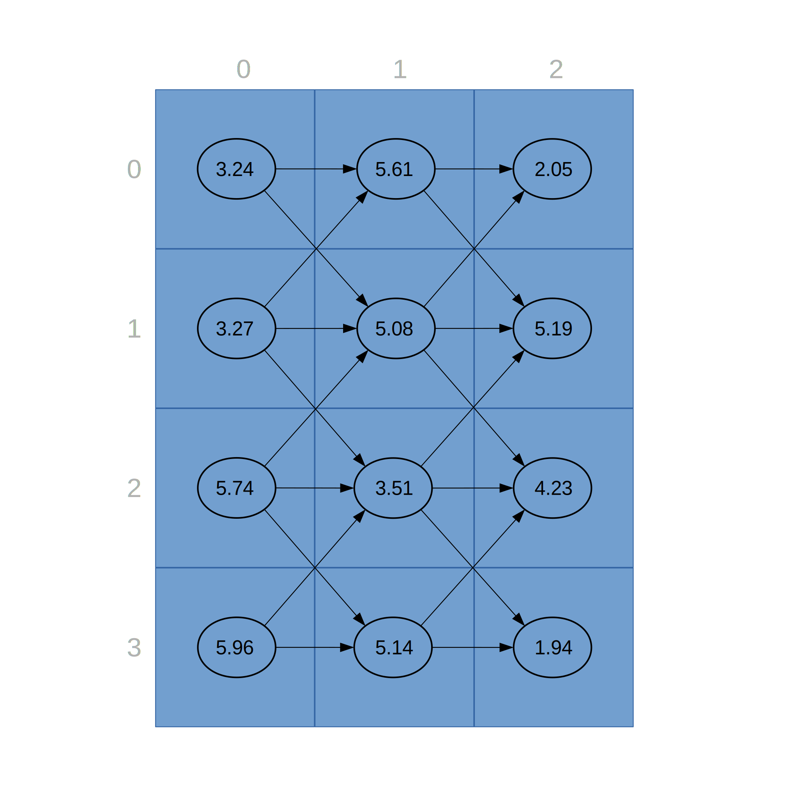

Étant donné que les arcs ne vont que de la gauche vers la droite, on peut calculer le plus court chemin depuis la gauche vers n'importe quelle case en une seule passe sur la matrice en partant de la gauche et en
progressant colonne par colonne vers la droite. La première colonne de la matrice contient juste les valeurs des sommets.

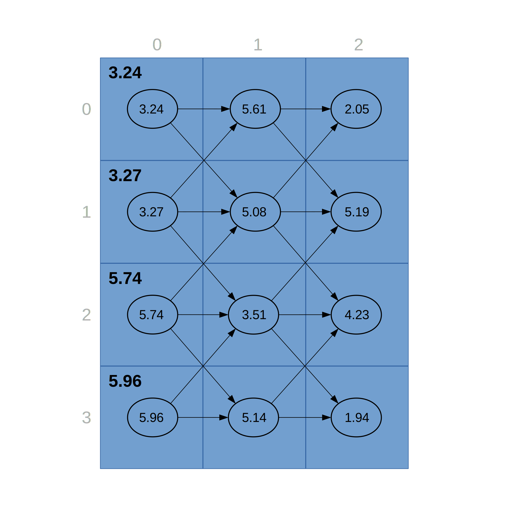

Ensuite on passe à la colonne suivante. Pour connaître le plus petit coût depuis la gauche vers le sommet `(0, 1)` on va se servir des informations de la colonne précédente.

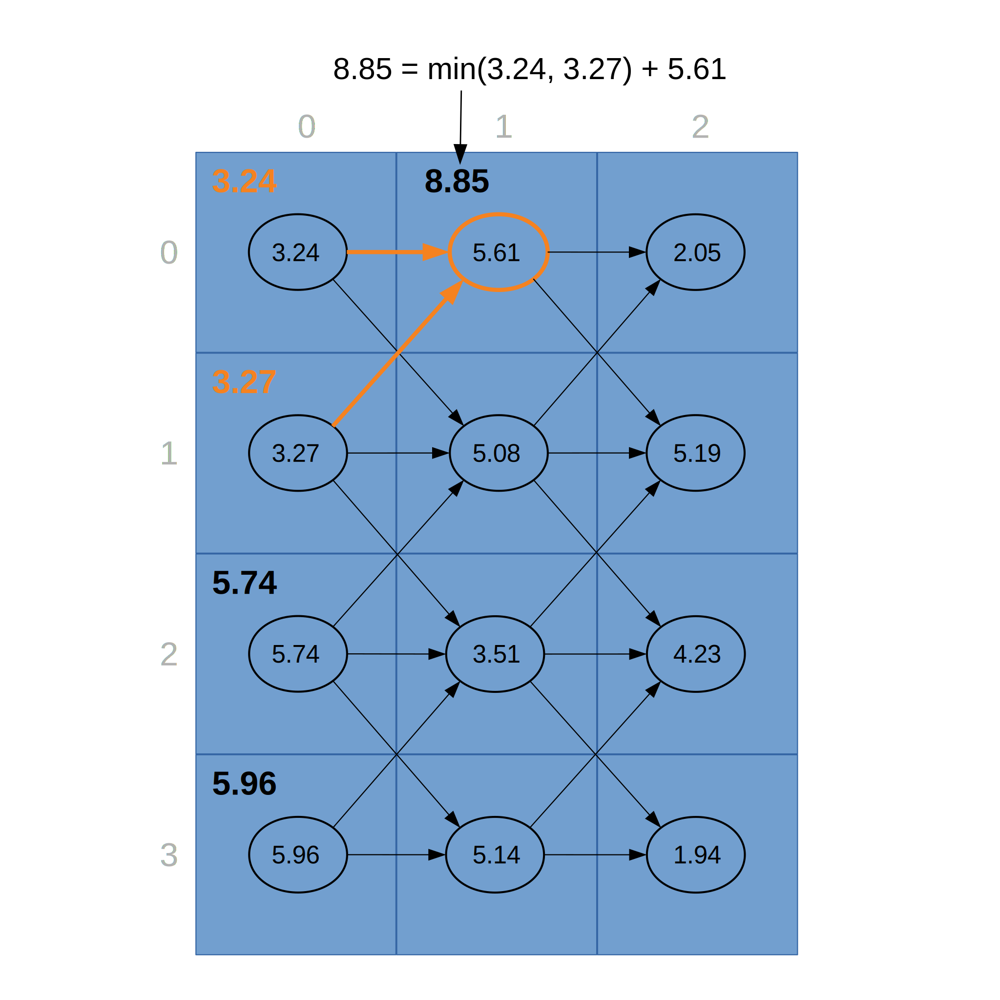

On fait de même pour le sommet `(1,1)` et on obtient le résultat de la figure suivante.

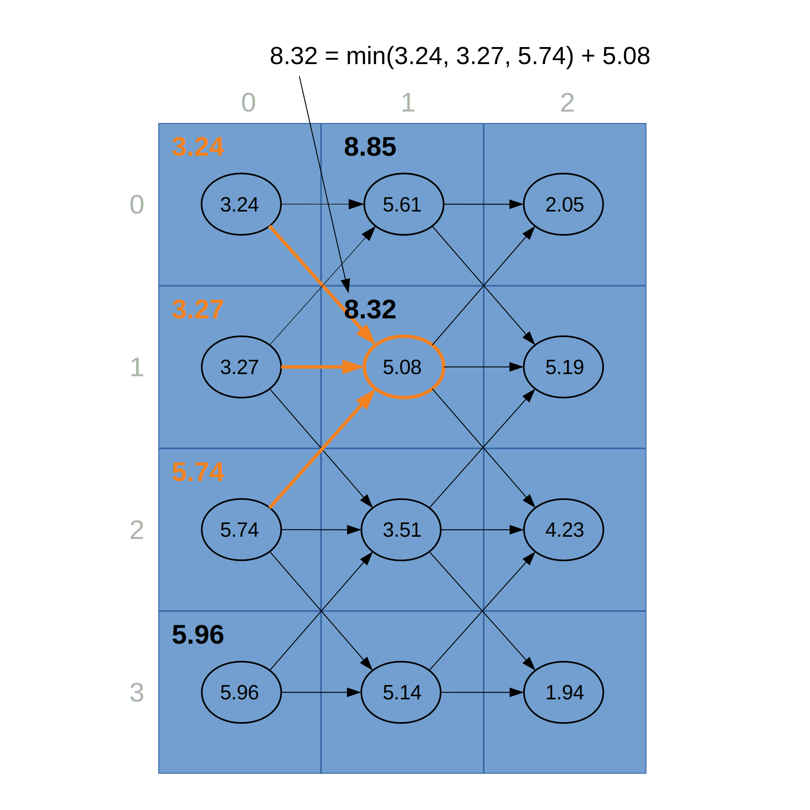

En continuant ainsi, on obtient la matrice complète suivante.

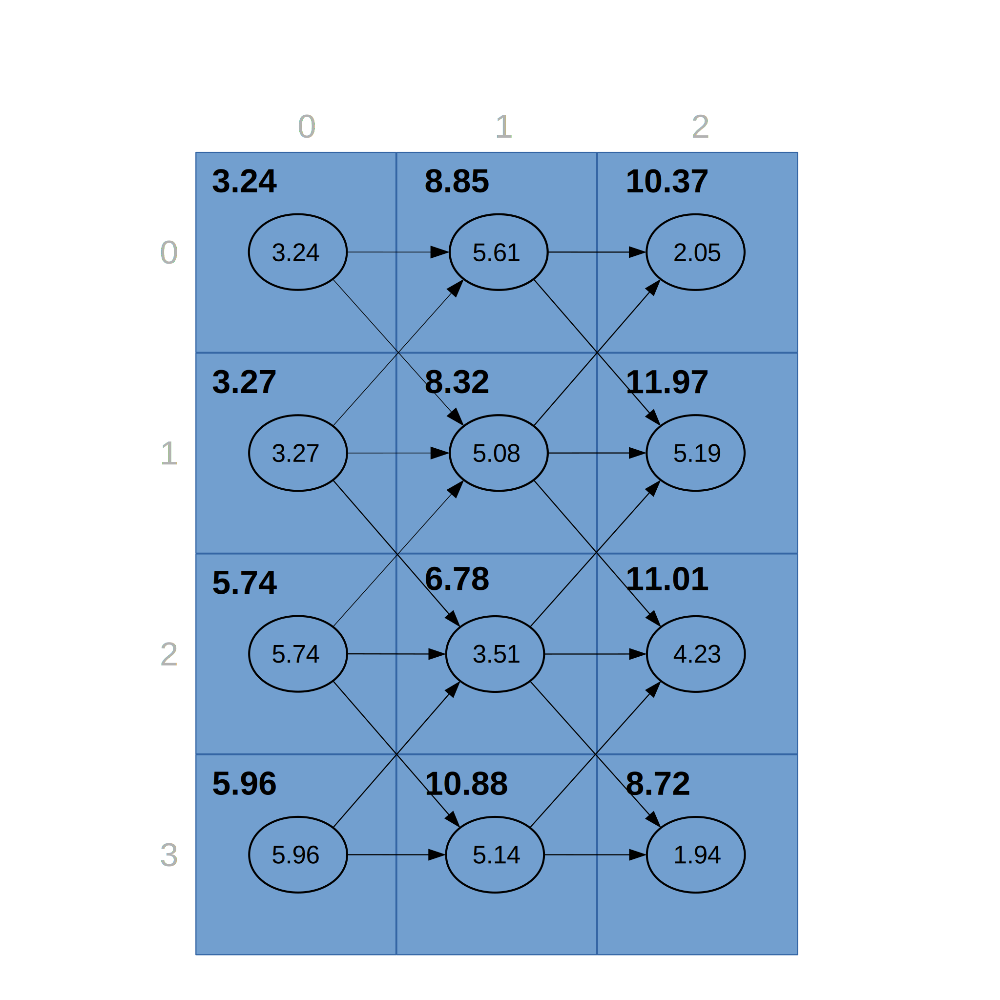

On peut ensuite reconstruire à rebours le plus court chemin grâce à cette matrice.

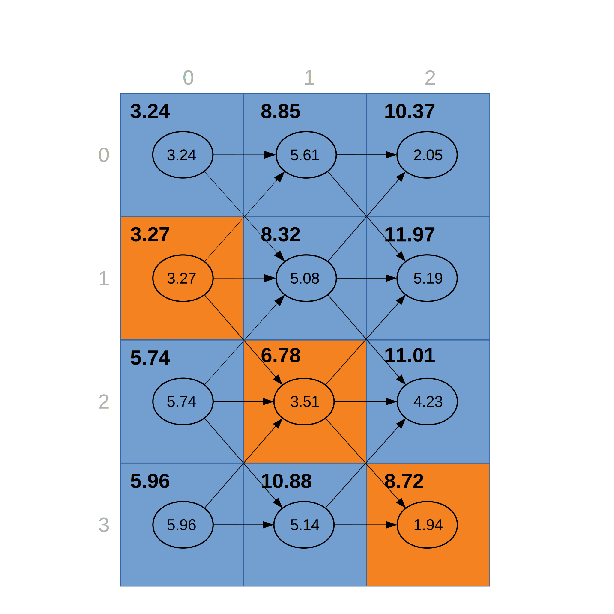

La complexité de notre implémentation de l'algorithme de `Dijkstra`, pour un graphe `g`, est en `O((g.numberOfVertices() + g.numberOfEdges()) * log(g.numberOfVertices()))`. La construction de la matrice
comme présentée précédemment est en `O(g.numberOfVertices() + g.numberOfEdges())`.

Vous devez compléter la classe `SeamCarverDP` du package `fr.insa_rennes.sdd.seam_carving`.

````java
public class SeamCarverDP extends SeamCarver {
    public SeamCarverDP(Picture picture) {
        super(picture);
    }
    public SeamCarverDP(Picture picture, BiFunction<Double, Double, Double> energyFunction) {
        super(picture, energyFunction);
    }
    @Override
    public void reduceToSize(int width, int height) {
        throw new UnsupportedOperationException();
    }
    @Override
    public Deque<Coordinate> horizontalSeam() {
        throw new UnsupportedOperationException();
    }
    @Override
    public Deque<Coordinate> verticalSeam() {
        throw new UnsupportedOperationException();
    }
}
````

Pour tester, vous devez modifier dans la classe `Controller` du package `fr.insa_rennes.sdd.javafx.controller` la méthode `loadImage` pour utiliser le `SeamCarverDP` à la place du `SeamCarverDijkstra`.

````java
@FXML
private void loadImage() {
    FileChooser fileChooser = new FileChooser();
    fileChooser.setTitle("Open Image File");
    File file = fileChooser.showOpenDialog(pane.getScene().getWindow());
    seamCarver = Optional.ofNullable(file)
        .map(f -> new SeamCarverDijkstra(new Picture(new Image(f.toURI().toString(), MAX_SIZE, MAX_SIZE, true, true))));
    if (seamCarver.isPresent()) {
        Image image = seamCarver.get().picture().image();
        zoomRatio = Math.min(canvas.getWidth() / image.getWidth(), canvas.getHeight() / image.getHeight());
    }
    draw();
}
````
Dans la ligne 7 il faut remplacer l'utilisation de `SeamCarverDijkstra` par `SeamCarverDP`.

Vous pouvez ensuite lancer l'application et vous devriez remarquer une meilleure réactivité maintenant (essayer de réduire la taille de la fenêtre par exemple).

</article>
